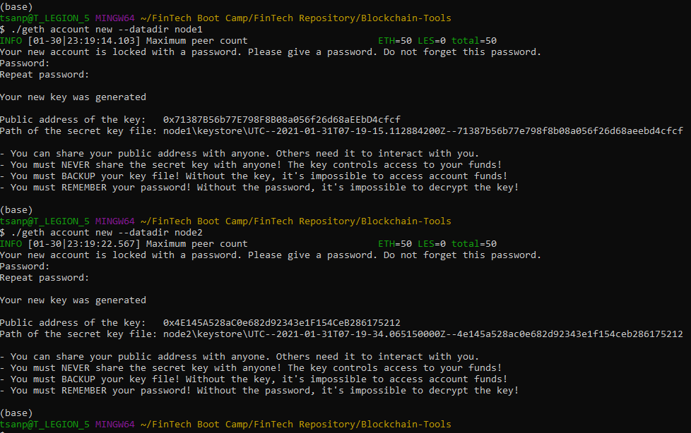
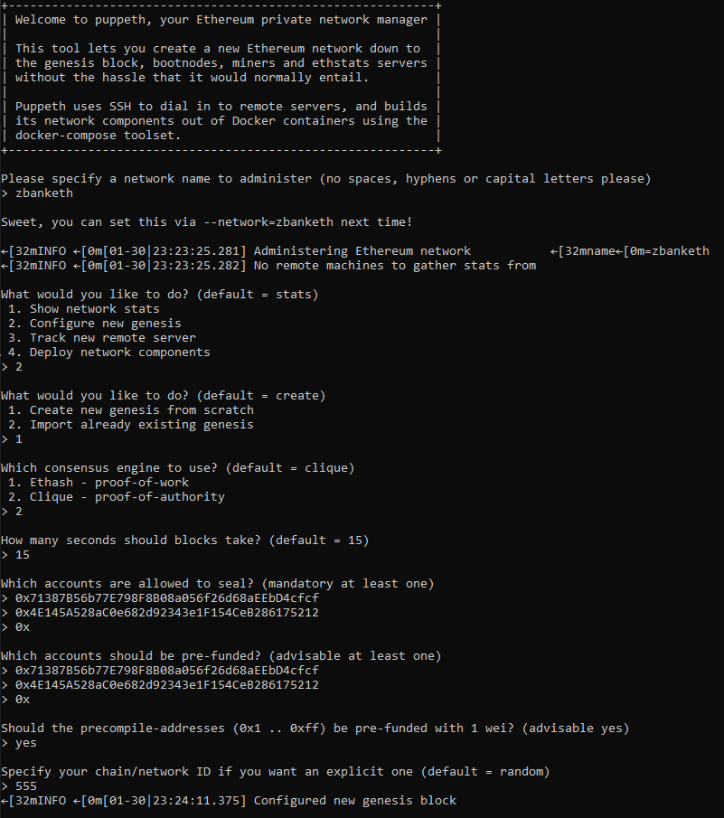
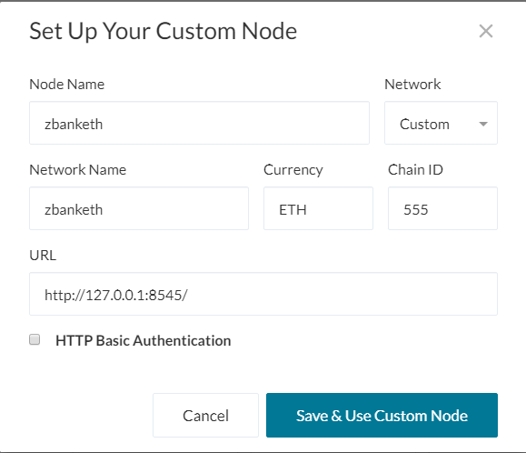
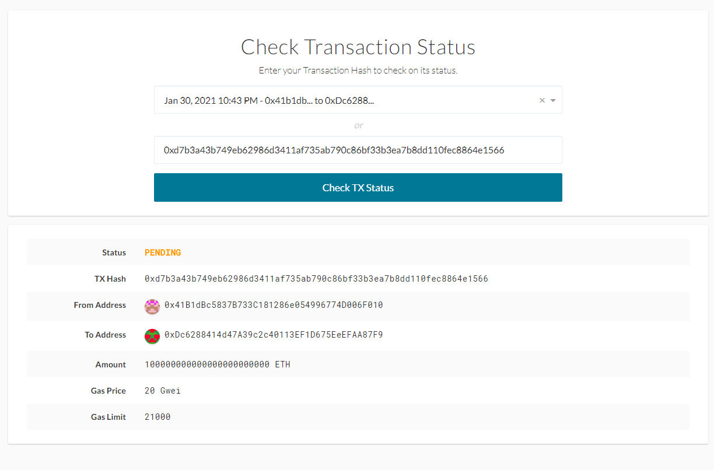

# ZBANK Blockchain Exploration
## Setup
- Install MyCrypto Application from https://download.mycrypto.com/.
- Download Go Ethereum Tools from https://geth.ethereum.org/downloads/.

 ### Create Test Account Nodes
 - Create 2 new account nodes using the command below. Use a password that you'll remember
 ```bash
 ./geth account new --datadir node1
 ./geth account new --datadir node2
 ```
 - keep note of the `Public Address` and `Path to Secret Key` for both nodes.



 ### Setup zbankcrypto Network
 - Run command 
 ```bash 
 ./puppeth 
 ```
 - Name the netwrok `zbanketh`
 - Choose 2 to `Configure new genesis`, then 1 to `Create new genesis from scratch`
 - Choose 2 for `Clique - Proof of Authority` algorithm.
 - Use default (15) for number of seconds blocks take
 - Paste node1 and node2 address, one at a time, to allowed to sealed.
 - Paste node1 and node2 address to be prefunded
 - Do not prefund any other account
 - Use `555` for chain/network ID
 - Now back at main menu. Choose 2 `Manage existing genesis`
 - Choose 2 to `Export genesis configurations`



 ### Initialize Nodes
 - Run command below to initialize both nodes
 ```bash
 ./geth init zbanketh.json --datadir node1
 ./geth init zbanketh.json --datadir node2
 ```
 
 ### Start node
 - Use command below to start node1 as miner. Note the enode address
 ```bash
 ./geth --datadir node1 --mine --minerthreads 1
 ```
 -- Flags Explained
  - `--datadir node1` - use data directory for the databases and keystore named `node1`
  - `--mine` - this will be a miner node
  - `minerthreads 1` - use only 1 thread to mine
 - Use command below to start node2 as boot node. Replace `NODE1 ENODE` with enode from step above
 ```bash
 ./geth --datadir node2 --port 30304 --rpc --bootnodes "NODE1 ENODE" --ipcdisable
 ```
 -- Flags Explained
  - `--port 30304` - start node with port 3034, because node1 is using default port (30303)
  - `--rpc` - Enable the HTTP-RPC server
  - `--bootnodes "NODE1 ENODE"` - Comma separated enode URLs for P2P discovery bootstrap
  - `--ipcdisable` - Disable the IPC-RPC server
  
## Connect to MyCrypto
- Open MyCrypto and click on "Change Network" then "Add Custom Node"
- Uses below settings



- Click on "Keystore File", then import node1 keystore from data directory. Login with the password use to create node1
- Send any amount of coin to node2 address
- Copy the transaction id and and click on TX status. Then, paste the transaction ID to see transaction completed

